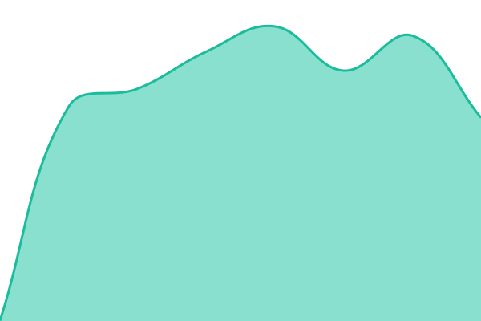
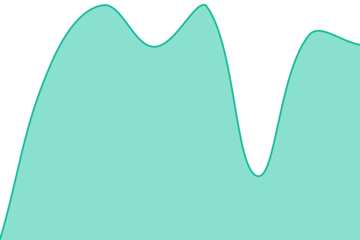

# [📈 Live Status](https://status.violaoacademy.com.br): <!--live status--> **🟩 All systems operational**

This repository contains the open-source uptime monitor and status page for [FiniAppBr](https://status.violaoacademy.com.br), powered by [Upptime](https://github.com/upptime/upptime).

With [Upptime](https://upptime.js.org), you can get your own unlimited and free uptime monitor and status page, powered entirely by a GitHub repository. We use [Issues](https://github.com/FiniAppBr/status/issues) as incident reports, [Actions](https://github.com/FiniAppBr/status/actions) as uptime monitors, and [Pages](https://status.violaoacademy.com.br) for the status page.

<!--start: status pages-->
<!-- This summary is generated by Upptime (https://github.com/upptime/upptime) -->
<!-- Do not edit this manually, your changes will be overwritten -->
<!-- prettier-ignore -->
| URL | Status | History | Response Time | Uptime |
| --- | ------ | ------- | ------------- | ------ |
|  [Site](https://violaoacademy.com.br/b/) | 🟩 Up | [site.yml](https://github.com/FiniAppBr/status/commits/HEAD/history/site.yml) | 

 553ms
     
 | 

<a href="https://status.violaoacademy.com.br/history/site">100.00%</a>
    

|  [Área de membros](https://app.violaoacademy.com.br/) | 🟩 Up | [area-de-membros.yml](https://github.com/FiniAppBr/status/commits/HEAD/history/area-de-membros.yml) | 

 562ms
     
 | 

<a href="https://status.violaoacademy.com.br/history/area-de-membros">100.00%</a>
    

|  [API](https://app.violaoacademy.com.br/api/v1/utils/health-check/) | 🟩 Up | [api.yml](https://github.com/FiniAppBr/status/commits/HEAD/history/api.yml) | 

 443ms
     
 | 

<a href="https://status.violaoacademy.com.br/history/api">100.00%</a>
    

|  [Admin](https://admin.violaoacademy.com.br/) | 🟩 Up | [admin.yml](https://github.com/FiniAppBr/status/commits/HEAD/history/admin.yml) | 

 552ms
     
 | 

<a href="https://status.violaoacademy.com.br/history/admin">100.00%</a>
    

|  [Do Zero ao Fingerstyle](https://dozeroaofingerstyle.com.br/) | 🟩 Up | [do-zero-ao-fingerstyle.yml](https://github.com/FiniAppBr/status/commits/HEAD/history/do-zero-ao-fingerstyle.yml) | 

 527ms
     
 | 

<a href="https://status.violaoacademy.com.br/history/do-zero-ao-fingerstyle">100.00%</a>
    

<!--end: status pages-->

[**Visit our status website →**](https://status.violaoacademy.com.br)

## 📄 License

- Powered by: [Upptime](https://github.com/upptime/upptime)
- Code: [MIT](./LICENSE) © [Anand Chowdhary](https://anandchowdhary.com)
- Data in the `./history` directory: [Open Database License](https://opendatacommons.org/licenses/odbl/1-0/)
